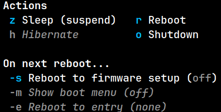

# systemctl.el

An emacs package for controlling systemd over dbus.

## Power Menu

This package includes a transient-based power menu (`systemctl-power-menu`):

In addition to the usual commands (sleep, reboot, shutdown, etc.):

- You can reboot into the firmware setup or even a specific operating system/kernel if your boot manager supports it. All unsupported features will be grayed out as in the above screenshot.
- If you increase the transient verbosity level (bound to `C-x a` in all transients by default), you can enter specific suspend states beyond the default "sleep" and "hibernate" options.

If transient menus aren't your style, all power commands can also be invoked as regular commands via `M-x` or bound to via keybindings (although none are defined by default). These commands are:

- `systemctl-suspend`
- `systemctl-hibernate`
- `systemctl-hybrid-sleep`
- `systemctl-suspend-then-hibernate`
- `systemctl-sleep`
- `systemctl-poweroff`
- `systemctl-reboot`
- `systemctl-halt` (you probably want `poweroff`, not `halt`)

They correspond to the same commands as defined on the `systemctl(1)` shell command.

## Session Locking

This package implements a borrows two commands from the `loginctl(1)` shell command for locking/unlocking sessions. They don't precisely belong in a `systemctl` package but they're useful enough to include.

- `systemd-lock` locks the current session, the target session when called with a session ID (may require polkit authentication), or all sessions when called with the symbol `t` (requires polkit authentication).
- `systemctl-unlock` is the inverse of `lock`.

I haven't implemented any of the other `loginctl(1)` commands at the moment but I'm open to suggestions.

## Service Management

Finally, as expected of a `systemctl` package, you can manage systemd services:

- `systemctl-start` starts a unit (service, timer, etc.), prompting for one if called interactively.
- `systemctl-stop` stops a service.
- `systemctl-reload` reloads the config of a running service.
- `systemctl-restart` starts or restarts a service. Only restarts already running services when called with a prefix arg.
- `systemctl-reload-or-restart` reloads the config of a running service, or restarts it. If the service isn't running, it's started unless called with a prefix argument.

## Daemon Config

You can reload the systemd daemon's config itself by calling `systemctl-daemon-reload`.
